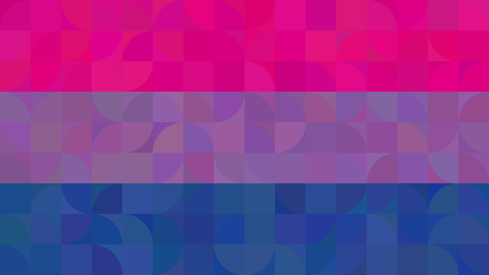
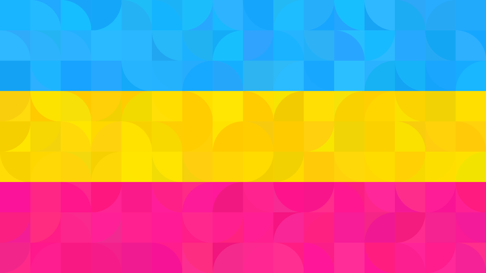
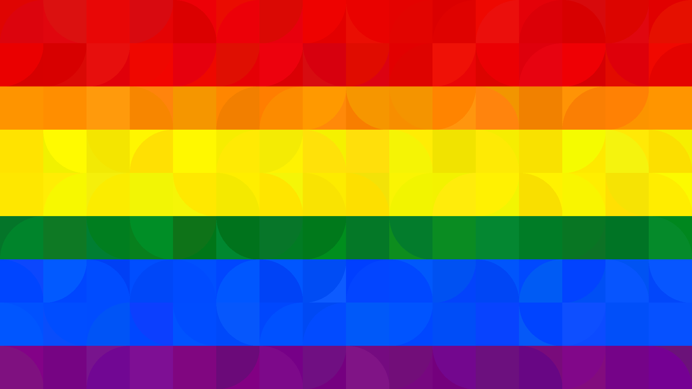
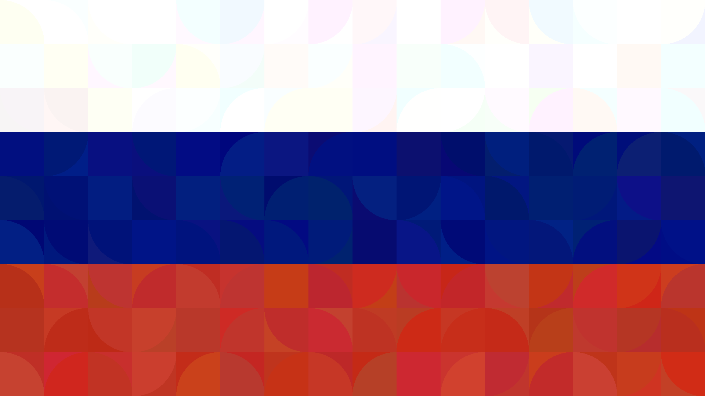
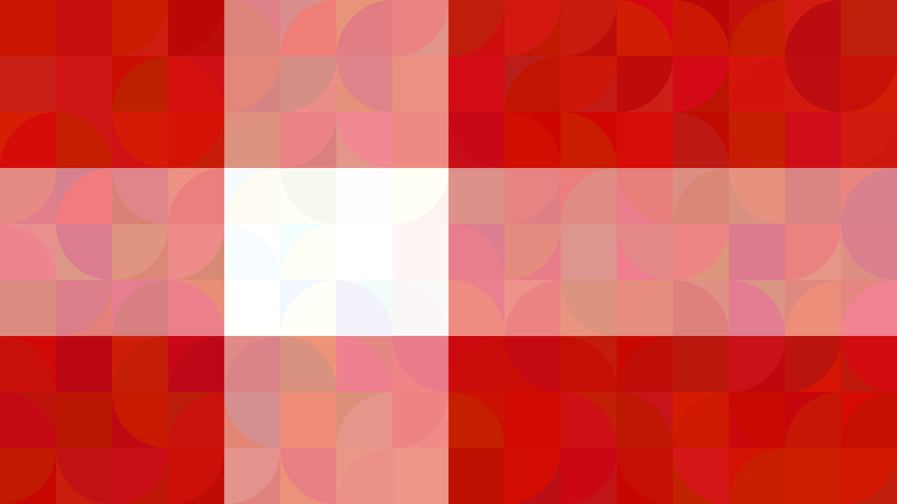

First of all, **happy birthday** Vikki! I hope you are having a great day and coming year.

I saw on your wishlist that you want some art, painted or written, and I thought I would combine both. This is my gift to you; I made some [*generative art*](https://en.wikipedia.org/wiki/Generative_art) for you by writing a small piece of [python code](https://en.wikipedia.org/wiki/Python_(programming_language)). I have some more ideas how to extend the code I have written, so if you like them I could work on a revision (for christmas maybe).

On this page I'll show you some of the paintings, and give you download links for different sized versions in case you want to set them as wallpapers. I'll also talk a little bit about how they are generated, cause I know you find that kinda stuff interesting.

## The Paintings

The inspiration for the paintings for you comes from the fact that our displays are in odd [aspect ratios](https://en.wikipedia.org/wiki/Aspect_ratio_(image)). For example, most PC monitors are 16:9, with Macs being 16:10. Most phones are either one but portrait instead of landscape. This means that if you wanted to fill the screen with equally sized squares it would be quite complicated because 16 and 9 are [coprime](https://en.wikipedia.org/wiki/Coprime_integers), and 16:10 only share a single factor 2. This means that dividing the screen's pixels into whole integer squares using the extended [GCD](https://en.wikipedia.org/wiki/Greatest_common_divisor) algorithm you don't get many choices for square sizes. My art for you is based on using possible square sizes and showing off this odd ratio by distorting regular flags according to those squares:

### Bi



##### Landscape

- [PC (1080p)](../assets/vikki/art/square_semi_circles_bi_0_1920x1080.png)
- [PC (1440p)](../assets/vikki/art/square_semi_circles_bi_0_2560x1440.png)
- [Mac (1600p)](../assets/vikki/art/square_semi_circles_bi_0_2560x1600.png)
- [PC (4k)](../assets/vikki/art/square_semi_circles_bi_0_3840x2160.png)
- [PC (8k)](../assets/vikki/art/square_semi_circles_bi_0_7680x4320.png)

##### Portrait

- [PC (1080p)](../assets/vikki/art/square_semi_circles_bi_1_1920x1080.png)
- [PC (1440p)](../assets/vikki/art/square_semi_circles_bi_1_2560x1440.png)
- [Mac (1600p)](../assets/vikki/art/square_semi_circles_bi_1_2560x1600.png)
- [PC (4k)](../assets/vikki/art/square_semi_circles_bi_1_3840x2160.png)
- [PC (8k)](../assets/vikki/art/square_semi_circles_bi_1_7680x4320.png)

### Pan



##### Landscape

- [PC (1080p)](../assets/vikki/art/square_semi_circles_pan_0_1920x1080.png)
- [PC (1440p)](../assets/vikki/art/square_semi_circles_pan_0_2560x1440.png)
- [Mac (1600p)](../assets/vikki/art/square_semi_circles_pan_0_2560x1600.png)
- [PC (4k)](../assets/vikki/art/square_semi_circles_pan_0_3840x2160.png)
- [PC (8k)](../assets/vikki/art/square_semi_circles_pan_0_7680x4320.png)

##### Portrait

- [PC (1080p)](../assets/vikki/art/square_semi_circles_pan_1_1920x1080.png)
- [PC (1440p)](../assets/vikki/art/square_semi_circles_pan_1_2560x1440.png)
- [Mac (1600p)](../assets/vikki/art/square_semi_circles_pan_1_2560x1600.png)
- [PC (4k)](../assets/vikki/art/square_semi_circles_pan_1_3840x2160.png)
- [PC (8k)](../assets/vikki/art/square_semi_circles_pan_1_7680x4320.png)

### Pride



##### Landscape

- [PC (1080p)](../assets/vikki/art/square_semi_circles_pride_0_1920x1080.png)
- [PC (1440p)](../assets/vikki/art/square_semi_circles_pride_0_2560x1440.png)
- [Mac (1600p)](../assets/vikki/art/square_semi_circles_pride_0_2560x1600.png)
- [PC (4k)](../assets/vikki/art/square_semi_circles_pride_0_3840x2160.png)
- [PC (8k)](../assets/vikki/art/square_semi_circles_pride_0_7680x4320.png)

##### Portrait

- [PC (1080p)](../assets/vikki/art/square_semi_circles_pride_1_1920x1080.png)
- [PC (1440p)](../assets/vikki/art/square_semi_circles_pride_1_2560x1440.png)
- [Mac (1600p)](../assets/vikki/art/square_semi_circles_pride_1_2560x1600.png)
- [PC (4k)](../assets/vikki/art/square_semi_circles_pride_1_3840x2160.png)
- [PC (8k)](../assets/vikki/art/square_semi_circles_pride_1_7680x4320.png)

### Rus



##### Landscape

- [PC (1080p)](../assets/vikki/art/square_semi_circles_rus_0_1920x1080.png)
- [PC (1440p)](../assets/vikki/art/square_semi_circles_rus_0_2560x1440.png)
- [Mac (1600p)](../assets/vikki/art/square_semi_circles_rus_0_2560x1600.png)
- [PC (4k)](../assets/vikki/art/square_semi_circles_rus_0_3840x2160.png)
- [PC (8k)](../assets/vikki/art/square_semi_circles_rus_0_7680x4320.png)

##### Portrait

- [PC (1080p)](../assets/vikki/art/square_semi_circles_rus_1_1920x1080.png)
- [PC (1440p)](../assets/vikki/art/square_semi_circles_rus_1_2560x1440.png)
- [Mac (1600p)](../assets/vikki/art/square_semi_circles_rus_1_2560x1600.png)
- [PC (4k)](../assets/vikki/art/square_semi_circles_rus_1_3840x2160.png)
- [PC (8k)](../assets/vikki/art/square_semi_circles_rus_1_7680x4320.png)

### Dk



##### Sizes

- [PC (1080p)](../assets/vikki/art/square_semi_circles_dk__1920x1080.png)
- [PC (1440p)](../assets/vikki/art/square_semi_circles_dk__2560x1440.png)
- [Mac (1600p)](../assets/vikki/art/square_semi_circles_dk__2560x1600.png)
- [PC (4k)](../assets/vikki/art/square_semi_circles_dk__3840x2160.png)
- [PC (8k)](../assets/vikki/art/square_semi_circles_dk__7680x4320.png)

### Filter

I've also applied a variant of the algorithm to a real picture of you with some friends. Maybe you can guess which one it was.


- [Download](/assets/vikki/art/01934966.jpg)


- [Download](/assets/vikki/art/ed9401b6.jpg)

## Code

In the code I first define the wanted output sizes and colorschemes:

```python
OUTPUT_SIZES = [
    (1920 * 4, 1080 * 4),
    (1920 * 2, 1080 * 2),
    (1920 * 1, 1080 * 1),
    (2560, 1440),
    (2560, 1600),
]
D1_COLOR_SCHEMES = {
    "bi": [(216, 9, 126), (140, 87, 156), (36, 70, 142)],
    "pan": [(33, 177, 255), (255, 216, 0), (255, 33, 140)],
    "pride": [(228, 3, 3), (255, 140, 0), (255, 237, 0), (0, 128, 38), (0, 77, 255), (117, 7, 135)],
    "rus": [(255, 255, 255), (1, 20, 122), (195, 52, 36)],
}
D2_COLOR_SCHEMES = {
    "dk": [[(200, 20, 10), (255, 255,255), (200, 20, 10), (200, 20, 10)], [(200, 20, 10), (255,255,255), (200, 20, 10)]],
}
```

This means I can (and have) easily add more output sizes or colorschemes. Each colorscheme is just a list of colors. For example "rus", for the russian flag is `[(255, 255, 255), (1, 20, 122), (195, 52, 36)]`, with each [tuple](https://en.wikipedia.org/wiki/Tuple) being a color. `(255, 255, 255)` is white, `(1, 20, 122)` is blue and `(195, 52, 36)` is red. These tuples represent a [RGB color value](https://en.wikipedia.org/wiki/RGB_color_model) between 0 and 255 in each color channel.

To generate the images I need to create a *canvas* to draw onto and find a the *squares*. The code below is commented with lines starting with `#` to describe what I am doing:

```python
# for all pairs of width and height, iterate through the OUTPUT_SIZES
# list defined above
for WIDTH, HEIGHT in OUTPUT_SIZES:
    # determine the greates common divisor:
    # the GCD *is* the largest side length of a integer square
    # which can fill the screen by repetition
    GCD = math.gcd(WIDTH, HEIGHT)
    # I do not split the GCD into more sub-squares here, but I do so
    # for the images based on pictures for greater detail
    MERGE_GCD = 1
    SQUARE_SIDE = GCD * MERGE_GCD
    # I define the chance of a semi-circle (actually a quarter-disk
    # if I think about it) to be drawn inside the square
    CHANCE_OF_SEMI_CIRCLE = 0.8

    # For the portrait and landscape version I do the rest twice;
    # once vertically and once horizontally
    for flag_dir in [TOP_DOWN, LEFT_RIGHT]:
        # The rest I do for each colorscheme in the colorschemes list
        for cs_name, colors in D1_COLOR_SCHEMES.items():
            # I craft a file name for the file I am about to generate,
            # containing all the information about it so far
            filename = f"square_semi_circles_{cs_name}_{flag_dir}_{WIDTH}x{HEIGHT}.png"

            # Now I create a canvas to draw onto, with the width and height
            # we want and a white background (#fff = white)
            img = Image.new("RGB", (WIDTH, HEIGHT), "#fff")

            # I create a version of the canvas that I can draw onto directly
            draw = ImageDraw.Draw(img)

            # I now iterate over the pairs of (x,y) which are the top-left
            # corner of SQUARE_SIDE sized squares in the picture
            for x in range(0, WIDTH, SQUARE_SIDE):
                for y in range(0, HEIGHT, SQUARE_SIDE):
                    # This means this inner loop is executed once per square
                    # The square boundaries are as follows: [x1, y1, x2, y2]
                    square_bounds = [x, y, x+SQUARE_SIDE, y+SQUARE_SIDE]
                    # This describes the boundary:
                    #
                    #     (x1, y1) ------- (x2, y1)
                    #        |                |
                    #        |                |
                    #     (x1, y2) ------- (x2, y2)
                    
                    if flag_dir == TOP_DOWN:
                        percentage = float(y)/HEIGHT
                    elif flag_dir == LEFT_RIGHT:
                        percentage = float(x)/WIDTH
                    
                    # I determine the closest color for the point (x,y)
                    # in the colorscheme
                    exact_color = int(percentage * len(colors))
                    # I mess with the color a little bit
                    # (at most 15 in each channel)
                    randomized_color = perturb_color(
                        colors[exact_color], 15)
                    # I draw the square at the calculated position with
                    # the slightly randomized color
                    draw.rectangle(
                        square_bounds, randomized_color)

                    # With a random chance (defined ealier)
                    # I draw the inner quarter-disk
                    if random.random() < CHANCE_OF_SEMI_CIRCLE:
                        # I randomly choose a corner
                        corner = _iuniform(0, 4)
                        # I map the numbers 0 - 3 randomly to the
                        # following corner of the square
                        # 0 = top-left, 1 = top-right, 2 = bottom-right, 3 = bottom-left
                        # All I need to know to define the position is 
                        # whether it is top or right-hand-side,
                        # so I just look it up in a hard-coded list:
                        rhs = corner in [1, 2] 
                        top = corner in [0, 1]
                        
                        # Then I have to draw the disk. This is quite complicated because
                        # I have to describe the disk to have its center at the corner we chose,
                        # and then start and end the *pieslice* at the correct angle:
                        draw.pieslice(
                            [
                                (x - (0 if rhs else SQUARE_SIDE),
                                    y - (SQUARE_SIDE if top else 0)),
                                (x + (2 * SQUARE_SIDE if rhs else SQUARE_SIDE),
                                    y + (SQUARE_SIDE if top else 2*SQUARE_SIDE))
                            ], start=(corner * 90), end=(corner + 1) * 90,
                            fill=perturb_color(colors[exact_color], 15)) 
                            # I fill it with a slightly random color again

            # I save the image and upload it here afterwards
            img.save(filename)
```

- [Disk](https://en.wikipedia.org/wiki/Disk_(mathematics))

Because I use randomness to change the colors slightly and choose when and where to place the quarter-disks new images are generated every time I run this code. There are an absurd number of different images this code can generate as is. The number of combination explodes everytime I add a new colorscheme.

## Conclusion

I hope you like the pictures and the idea. If you have a colorscheme you would like me to add just let me know, its easy to do so.

I wish you only the best for your next year. 🎉

— Markus