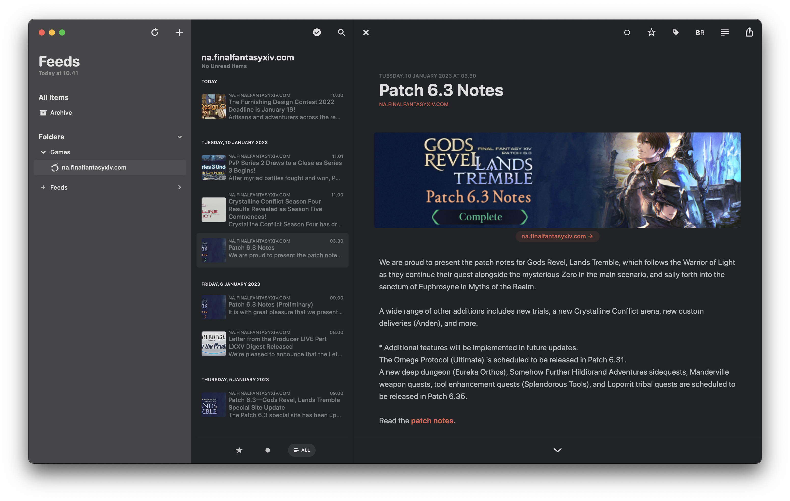
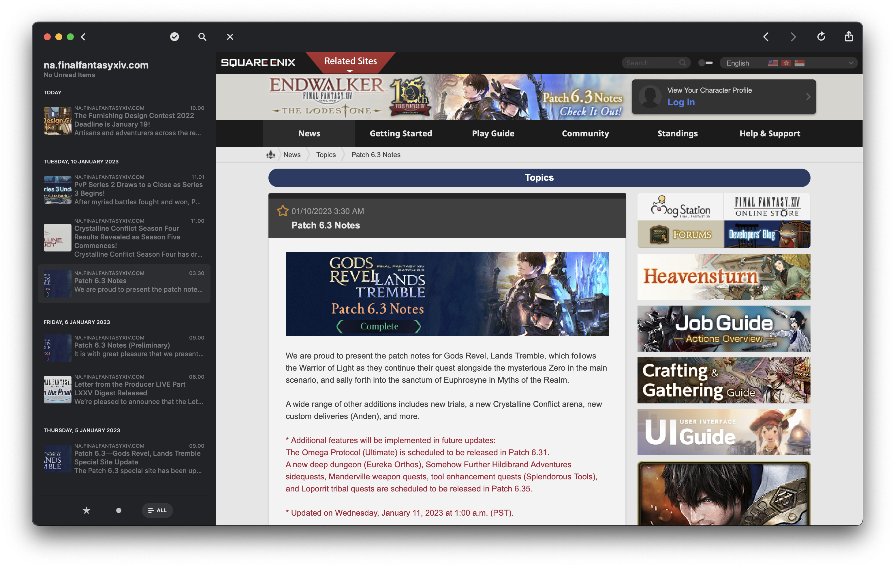

I wanted a better way to stay up to date on Final Fantasy XIV news without remembering to go to their news sites.
I use [RSS Feeds](https://en.wikipedia.org/wiki/RSS), that I check daily anyways (Reeder on MacOS to be specific).

The feeds contain the subjects, release date and short description for current events.
If the news page change too much these feeds might temporarily break.
In case that happens, or in case anyone has improvement ideas, I am happy to accept PRs on [GitHub](https://github.com/mtib/ffxiv-lodestone-rss) (TypeScript).

The RSS feeds are available at https://feeds.mtib.dev/na.finalfantasyxiv.com.rss and https://feeds.mtib.dev/eu.finalfantasyxiv.com.rss for the US and EU servers respectively.
The feed will be updated at least hourly (but cached by CDN, so no strong guarantees on freshness).

By the way RSS feeds work, and the data I have available when scraping the news pages, only the current events are contained in the RSS feed, however, most RSS Feed readers will save older entries, just be aware that if you add this feed to your reader you might only see a few new events.

The code generating this is available here: https://github.com/mtib/ffxiv-lodestone-rss

