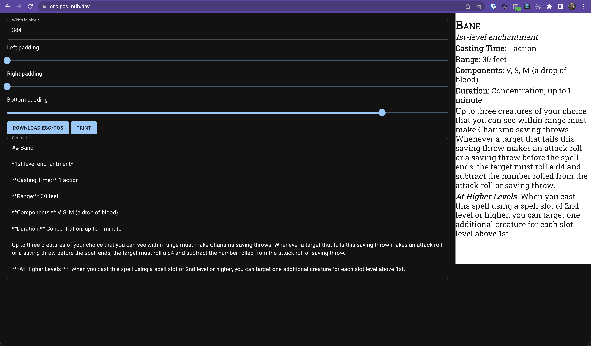

As a response to [SND](https://github.com/BigJk/snd) I created [this repo](https://github.com/mtib/esc-pos-generator) as an alternative that requires no setup and can be used by simply visiting [esc.pos.mtib.dev](https://esc.pos.mtib.dev/) with only static assets and no server side at all.
It comes with its own ESC/POS _driver_, only depending on WebUSB for communication with the hardware.
By rendering Markdown to HTML, then converting that HTML into SVG which can be rendered on a canvas, that canvas is then Dithered and its image data is converted to a ESC/POS image print command that is sent to the printer directly.
Hosting is taken care of by GitHub Pages, so there are no running costs associated with this.
If you do not trust my version running, the code is open source and it is incredibly easy to self-host.

Only browsers supporting [WebUSB](https://wicg.github.io/webusb/#usb) are supported ([Chromium-based](https://caniuse.com/webusb) as of writing).
Most Thermal Printers _speak_ ESC/POS, and for those no special drivers are required as long as USB communication is possible.

I am planning to use it with Markdown conversions of the [DND.SRD](https://github.com/OldManUmby/DND.SRD.Wiki) but because it is just printing rendered Markdown it is very easy to modify or create custom content.

I may add some sort of client-side filesystem to the app to store and restore documents, or add the option to share and recall state using the URL, but so far I rely on copy-pasting or writing Markdown directly in the input field.
